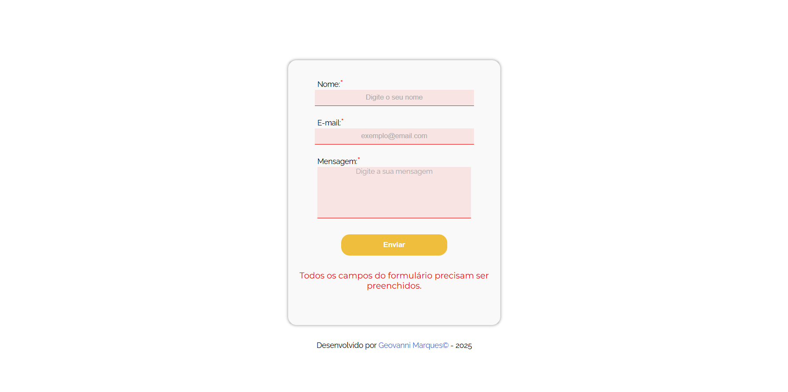
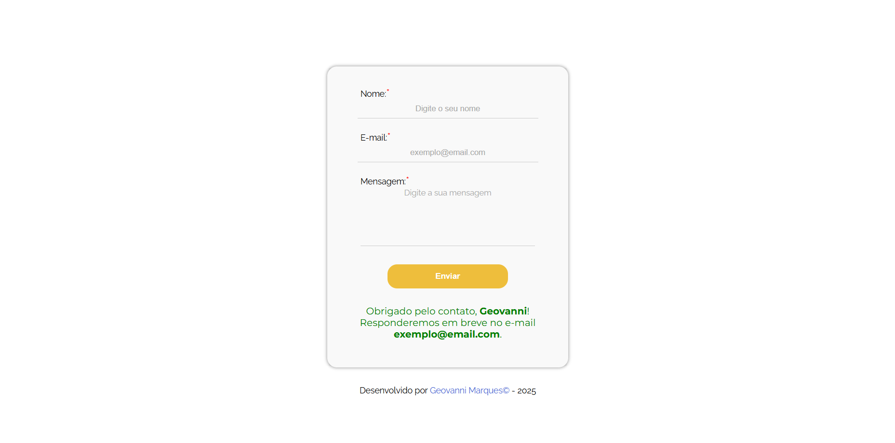

# 📋Formulário de contato simples com validação - JavaScript


 Esse projeto demonstra a criação de um projeto de formulário responsivo de contato simples, com validação de campos utilizando JavaScript. Quando todos os campos obrigatórios são preenchidos corretamente, o formulário é enviado por meio do serviço [FormSubmit](https://formsubmit.co/). O projeto foi desenvolvido com HTML, CSS e JavaScript puro.

 ## 📷 Prévia do projeto

Abaixo, uma visualização da interface do formulário em ação:

### ❌ Validação com erro



### ✅ Formulário enviado com sucesso



## ✅ Requisitos do formulário:
- Nome (campo de texto); 
- E-mail (campo de texto);
- Mensagem (campo de texto ou `<textarea>`)
- Botão "Enviar";

## 🛠️ Tecnologias utilizadas
- 🧱 **HTML5**
- 🎨 **CSS3**
- 🧠 **JavaScript**

## 📌 Estrutura do projeto
```
📂 formulario-validacao-js
├── 📂assets
│   └── 📂img
|       ├── formulario-de-contato.png
|       ├── formulario-envio-preview.png
│       └── formulario-erro-preview.png
├── 📂src
│   ├── 📂css
│   │   └── style.css
│   └── 📂js
│       └── main.js
├── .gitignore
├── index.html
├── LICENCE
└── README.md 
```

## 💻 Funcionalidades - JavaScript:
- ✅ **Validação de campos obrigatórios**
- ⚠️ **Exibição de mensagens de erro**
- 📬 **Mensagem personalizada de sucesso após envio**

## 🧩 Recursos utilizados:
- `.value.trim()` para validar se o campo foi preenchido.
- `document.getElementById()` para acessar os campos.
- Mensagem de erro e sucesso exibidas dentro de um `<p>` com `id="mensagem"`.

## 🚀 Estilos dinâmicos aplicados:
- Após usuário clicar em campo para inserir entrada de dados, o espaço é realçado da seguinte maneira: 
    ```css
    input:focus, #textarea:focus {
    border-bottom: 2px solid #0077ff;
    outline: none;
    background-color: #f0f8ff;
    }   
    ```
- Em caso de erro, é mostrada ao usuário uma mensagem de aviso em vermelho.
- Após verificação através do código JavaScript, caso haja campos com erro, o espaço vazio ou com entrada inválida é realçada da seguinte maneira:
    ```css
    input.erro, #textarea.erro {
    border-bottom: 1px solid red;
    background-color: rgba(255, 0, 0, 0.082);
    color: #aaa;
    outline: none;
    }
    ```
- Caso não haja erro, é mostrada ao usuário uma mensagem de sucesso em verde.

## 📨 Simulação de envio de formulário

📨 Simulação de Envio do Formulário
Inicialmente, o formulário não era realmente enviado — event.preventDefault() impedia esse comportamento. Posteriormente, foi adicionada uma simulação de envio utilizando o serviço [FormSubmit](https://formsubmit.co/), removendo a prevenção no código JS.

O envio é feito via HTML:

```html
<form action="https://formsubmit.co/seu-email-aqui@exemplo.com" method="post" id="formulario">
```

> ⚠️ Atenção: substitua `seu-email-aqui@exemplo.com` pelo seu e-mail real para que o envio funcione corretamente via [FormSubmit](https://formsubmit.co/).

## 🏆 Autor
Desenvolvido com muito 💛 por [**Geovanni Marques**](https://github.com/GeovanniMarques) 🚀 

Sinta-se à vontade para contribuir, comentar ou sugerir melhorias!

## 📄 Licença
Este projeto está licenciado sob a [Licença MIT](https://opensource.org/license/MIT) — veja mais detalhes no arquivo [LICENSE](./LICENSE).  
Sinta-se à vontade para usar, modificar e distribuir este código, desde que os créditos sejam mantidos.

